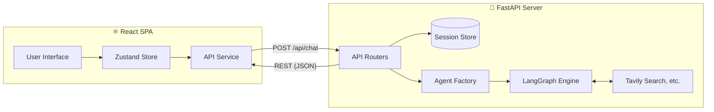

<div align="center">

# DeepAgent Studio

     

<br/>

DeepAgent Studio is a clean, modular, and extensible full-stack application for building advanced AI agents, leveraging the power of FastAPI, React, and LangGraph.

</div>

---

**Key Features:**

- **Context Engineering:** Loads durable `AGENTS.md` context and specific skills (Python, AWS, LangGraph, etc.) into the agent's memory.
- **Subagent Delegation:** Includes a `research-agent` for deep web searches and a `structured-researcher` that enforces Pydantic JSON outputs.
- **Virtual File System:** Maintains an isolated in-memory or on-disk file system for the agent to read and write without polluting your actual drive.
- **Session Management:** Robust server-side state with thread-safe UUID-based session tracking.

---

## 🏗️ Architecture Flow



1. **Frontend:** User configures the agent (Model, Backend Type, Prompts) via a clean Tailwind UI. State is managed by Zustand.
2. **Backend:** FastAPI receives the configuration, retrieves the user's `SessionData`, and dynamically builds the LangGraph agent via the Factory.
3. **Execution:** The agent executes tools and subagents in a dedicated thread to prevent blocking the async event loop.
4. **Response:** Results are returned cleanly formatted to the React UI, including expandable Tool Call cards and Virtual File panels.

---

## 🚀 Setup & Installation

### Prerequisites

- Python 3.13+ (We recommend using `uv` for dependency management)
- Node.js 18+ & npm

### 1. Environment Setup

Clone the repository, then set up your API keys:

```bash
cp .env.example .env
```

Open `.env` and add your required API keys (e.g., `OPENAI_API_KEY`, `GOOGLE_API_KEY`, `GROQ_API_KEY`, `TAVILY_API_KEY`). **Note:** `.env` is ignored by Git to protect your secrets.

### 2. Start the Backend

Open your terminal in the project root:

```bash
# Install Python dependencies (using uv)
uv sync

# Or using standard pip:
# pip install -r requirements.txt

# Start the FastAPI server
python main.py
```

_The backend will run at `http://127.0.0.1:8000`._

### 3. Start the Frontend

Open a **second terminal** and navigate to the frontend folder:

```bash
cd frontend

# Install Node dependencies
npm install

# Start the Vite development server
npm run dev
```

_The frontend will run at `http://localhost:5173`. (Vite automatically proxies `/api` requests to the backend)._

---

## 📁 Project Structure

```text
DeepAgent_Studio/
├── backend/          # FastAPI server, LangGraph agent factory, session store & tools
├── frontend/         # React SPA (Vite + Tailwind CSS + Zustand)
├── data/             # System context (AGENTS.md) and skills (aws, langgraph, python, report-writer)
├── main.py           # FastAPI server entry point
├── pyproject.toml    # Dependencies & project metadata
└── .env.example      # Environment variable template
```

---

## 🛠️ Adding New Tools

The architecture is designed to be highly modular. To give your agent a new ability:

1. Create a new file in `backend/tools/` (e.g., `calculator.py`).
2. Define a standard Python function with type hints and a clear `"""docstring"""` explaining what the tool does.
3. Import the function into `backend/agents/factory.py` and append it to the `ALL_TOOLS` array.

_The agent will immediately possess the new skill upon the next chat request!_
